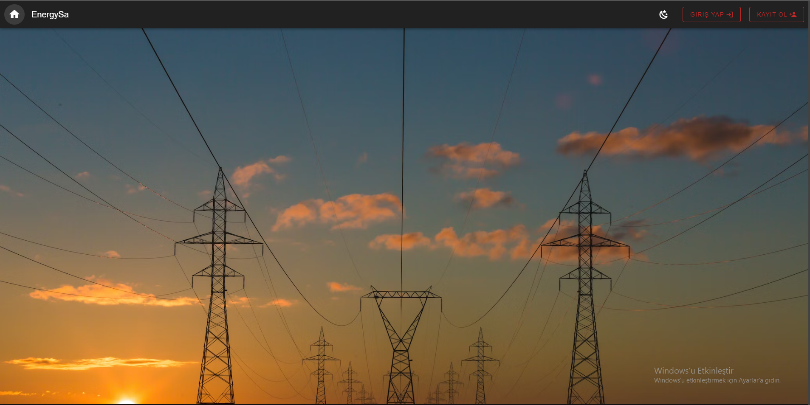
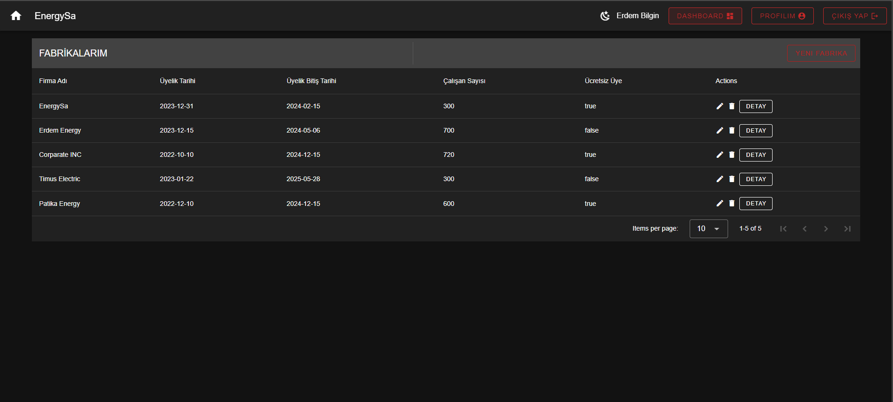

# Timus-Bootcamp-Final-Case

Proje kapsamında enerji kullanımlarını gösteren tablo yoğunluklu kullanıcı giriş ekranlı dashboord
tasarlanmıştır. Proje için Frontend ve Backend ayrı hazırlanmıştır.

## Backend

Backend kısmı NestJS ile hazırlanmıştır.
Backendin çalıştırılması için:

.env içeriğinin oluşturulması gerekmektedir.

`cd server/`
`npm install`
`npm run dev`

Kullanıcı giriş apilerinde elasticsearch, Fabrika ve detay apilerinde postgress kullanılmıştır. Kullanıcı giriş yaptığında server tarafından bir access token gönderilecektir. Fabrika ve detay tablolarına ulaşmak için isteklerin headers kısımlarına Authorization başlığı altında "Bearer access_token" gönderilmelidir.

## Frontend

Frontend kısmı VueJs ve vuetify ile hazırlanmıştır.
Frontendin çalıştırılması için:

`cd client/`
`npm install`
`npm run dev`

### Frontend projesi ekran görüntüleri

#### Ana ekran

#### Kullanıcı Kayıt

● Kullanıcı kaydında ad, email, parola ve yetki (admin veya editor) durumu istenecek tüm
bilgiler tam olmadığı sürece kayıt yapılmayacak ve hata mesajı verecektir.

● Navbardaki ay düğmesine tıklanılarak sitenin teması değiştirilebilir.

#### Kullanıcı Giriş

● Kullanıcı giriş yaptıktan sonra profil ayarlarına ve dashboardlara erişebilecektir.

#### Kullanıcı Profili

#### Fabrika Tablosu

#### Fabrika Detay Tablosu

